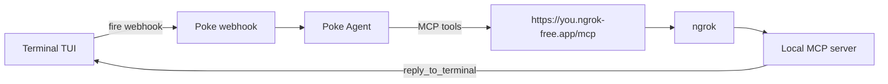

# 🌴 poke-tui-ngrok

A terminal UI for [Poke](https://poke.com) — chat with your AI assistant without leaving the terminal.

Built with [Ink](https://github.com/vadimdemedes/ink) (React for CLIs) and the [Poke SDK](https://www.npmjs.com/package/poke). This package uses a **sticky ngrok MCP URL** (Kitchen API key path) instead of Poke’s login tunnel.

## Quick start

```bash
npx poke-tui-ngrok
```

On first run you will be asked for:

1. A Poke API key from [poke.com/kitchen/api-keys](https://poke.com/kitchen/api-keys)
2. An [ngrok](https://ngrok.com) authtoken and free static domain (for a sticky public MCP URL)

Then add the printed MCP URL once in [Poke Integrations](https://poke.com/integrations/new) and type `/mcp done`.

## How it works

**poke-tui-ngrok** fires a persistent **webhook** (created once with your Kitchen API key) for each chat turn. For terminal replies it runs a local [MCP](https://modelcontextprotocol.io) server on a **sticky ngrok URL** registered once in Poke Integrations. The agent calls `reply_to_terminal` so answers land in your TUI.



The terminal webhook is stored in config as `terminalWebhook` and reused across launches (`/logout` clears it).

## Setup

On first run you’ll pick a connection mode:

### 1. poke login

Uses official `PokeTunnel` after browser device-code login. No ngrok / Integrations URL needed.

### 2. API key + ngrok

Kitchen API key (bypasses Poke tunnel — those keys get 403 on tunnel create). Needs:

1. API key from [poke.com/kitchen/api-keys](https://poke.com/kitchen/api-keys)
2. ngrok authtoken + free static domain
3. One-time Integrations link, then `/mcp done`

Or set:

```bash
export POKE_API_KEY=your_key_here
export NGROK_AUTHTOKEN=your_token
export NGROK_DOMAIN=your-name.ngrok-free.app
```

`/logout` clears config so you can pick again.

## Commands

| Command | Description |
|---------|-------------|
| `/help` | Show available commands |
| `/status` | Show connection status |
| `/doctor` | Diagnose the reply round-trip end to end |
| `/mcp` | Show MCP URL and setup status |
| `/mcp done` | Mark MCP setup complete (after adding the integration) |
| `/webhook create <when> \| <do what>` | Create a webhook trigger |
| `/webhook fire <#> {"data":"here"}` | Fire a webhook with JSON data |
| `/webhooks` | List active webhooks |
| `/clear` | Clear the chat |
| `/logout` | Clear saved config and quit |

Type `/` to see command suggestions; use ↑↓ and Tab to autofill.

## Endpoint auth

Poke has no reply API — the only way to get an answer back into the terminal is to run
an MCP server and have Poke call `reply_to_terminal`. In API-key mode that server is
public at your sticky ngrok domain, so anyone who finds the URL could post fake replies.

poke-tui generates a random token on first launch, stores it as `mcpToken` in the config,
and rejects `/mcp` requests without `Authorization: Bearer <token>`. The token is stable
across launches so your integration keeps working; it goes in the **API Key** field when
you add the integration (the setup link tries to prefill it, and `/mcp` prints it).

`/health` stays open — it is the reachability probe `/doctor` uses.

Login mode is unaffected: that server only listens on localhost behind Poke's own tunnel.

## Webhooks

Create automated triggers that fire your Poke agent with data:

```
/webhook create When a deploy fails | Summarize the error and suggest a fix
/webhook fire 0 {"repo":"my-app","error":"OOM killed","status":"failed"}
```

## Key bindings

| Key | Description |
|-----|-------------|
| `Enter` | Send message |
| `Ctrl-C` | Quit |
| `Esc` | Dismiss the thinking spinner (the reply still arrives) |

## Requirements

- Node.js 18+
- A [Poke](https://poke.com) Kitchen API key
- An [ngrok](https://ngrok.com) account with a free static domain

## Configuration

Config is stored at `~/.config/poke-tui/config.json`:

```json
{
  "apiKey": "your_key_here",
  "ngrokAuthToken": "...",
  "ngrokDomain": "your-name.ngrok-free.app",
  "mcpUrl": "https://your-name.ngrok-free.app/mcp",
  "mcpSetupComplete": true,
  "terminalWebhook": {
    "triggerId": "...",
    "webhookUrl": "https://poke.com/api/v1/inbound/webhook",
    "webhookToken": "..."
  }
}
```

| Environment variable | Description |
|----------------------|-------------|
| `POKE_API_KEY` | Poke Kitchen API key |
| `POKE_API` | API base URL (default `https://poke.com/api/v1`) |
| `NGROK_AUTHTOKEN` | ngrok authtoken |
| `NGROK_DOMAIN` | Sticky ngrok domain |

To reset, delete the config file and run `npx poke-tui-ngrok` again.

## Project structure

```
bin/
  poke-tui.js       Entry point (npx bin), onboarding flow
src/
  app.js            Wires MCP server, public tunnel, Poke client, and TUI
  config.js         Config load/save helpers
  mcp-server.js     Local MCP server
  poke-client.js    Poke SDK wrapper (sendMessage / webhooks)
  public-tunnel.js  Sticky ngrok forwarder
  tui.js            Ink (React) terminal UI
```

## Credits

- [Poke](https://poke.com) by [The Interaction Company of California](https://interaction.co)
- [Ink](https://github.com/vadimdemedes/ink) by Vadim Demedes
- [Poke SDK](https://www.npmjs.com/package/poke)
- [ngrok](https://ngrok.com)

## License

MIT
